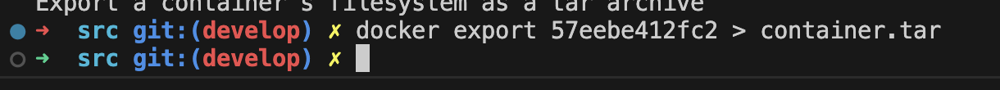
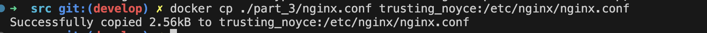

## Part 1. Готовый докер

- __Docker__ - это программное обеспечение для автоматизации развёртывания и управления приложениями в средах с поддержкой контейнеризации.

- В первую очередь потребуется установить несколько инструментов и расширений.
    - В VS Code необходимо установить интерфейс командной строки Docker.
    - После авторизации на DockerHub и в приложении Docker, можно скачивать готовые докер образы с официального сайта.
    - Если не запускается docker на школьном маке вот инструкция: https://21-school-by-students.notion.site/Docker-install-on-school-iMacs-9354ef106a8a40c6b46a69cea0a11bf8

1) Возьмем официальный докер-образ с _nginx_ и скачаем его при помощи __docker pull__.

- Используем команду __docker pull nginx__

    - __docker__ - это команда для взаимодействия с Docker. Она вызывает Docker CLI (интерфейс командной строки).
    - __pull__ - это команда Docker, которая используется для загрузки образов из репозитория. 

2) Проверим наличие докер-образа через __docker images__. Команда __docker images__ используется для вывода списка всех образов Docker, которые находятся в локальном репозитории на вашем компьютере.
- 
    - В выводе видим таблицу, где:
    - _REPOSITORY_ - название образа (в данном случае - nginx)
    - _TAG_ - тег образа, обычно используется для указания версии (например, latest - новая версия)
    - _IMAGE ID_ - уникальный идентификатор образа
    - _CREATED_ - дата создания образа
    - _SIZE_ - размер образа на диске

3) Запустим докер-образ через docker __docker run -d [image_id|repository__].

- Используем команду __docker run -d nginx__
- 
    - _run_ - запускает Docker-контейнер.
    - _-d_ - это опция, которая указывает Docker запустить контейнер в "detached" режиме. Это означает, что контейнер будет работать в фоновом режиме, и вы сможете продолжать использовать терминал для других команд.
    - чтобы увидеть, что происходит внутри контейнера, вы можете использовать команды __docker logs__ или __docker attach__.

4) Проверим, что образ запустился через __docker ps__.
- 

5) Посмотрим информацию о контейнере через __docker inspect [container_id|container_name]__.
- Используем команду __docker inspect compassionate_sanderson__
- 

    - По выводу команды определи и помести в отчёт:
    - размер контейнера;
    - 
    - список замапленных портов;
    - 
    - ip контейнера.
    - 

6) Остановим докер образ через __docker stop [container_id|container_name]__ и проверим, что образ остановился через __docker ps__.
- Используем команду __docker stop compassionate_sanderson__
- 

7) Запустим докер с портами 80 и 443 в контейнере, замапленными на такие же порты на локальной машине, через команду __docker run -d -p 80:80 -p 443:443 nginx__.

- Используем команду __docker run -d -p 80:80 -p 443:443 nginx__
- 

- __-p 80:80__: эта опция "замапливает" (связывает) порт 80 внутри контейнера на порт 80 на хост-машине (вашем компьютере). Это позволяет получить доступ к приложению, работающему на порту 80 внутри контейнера, с внешней стороны.
- __-p 443:443__: аналогично, эта опция связывает порт 443 внутри контейнера с портом 443 на хост-машине. Это может быть полезно, например, для доступа к HTTPS-приложению, работающему внутри контейнера.

8) Проверим, что в браузере по адресу __localhost:80__ доступна стартовая страница _nginx_.
- Используем команду __localhost:80__ в браузере
- 

- _Браузер отправит HTTP-запрос на ваш локальный компьютер (localhost) на порт 80. Docker перенаправит этот запрос на порт 80 внутри запущенного контейнера Nginx. Nginx внутри контейнера обработает запрос и вернет стартовую страницу Nginx. Браузер отобразит эту стартовую страницу Nginx._

9) Перезапустим докер контейнер через __docker restart [container_id|container_name]__ и сразу проверим запущенный процесс с помощью команды __docker ps__. Столбец _status_ показывает, что контейнер перезапустился 1 секунду назад.
- Используем команду __docker restart magical_mestorf__
- 

10) Проверим, что контейнер запустился, обращаясь через браузер на порт 80 нашего локального хоста.
- Используем команду __localhost:80__ в браузере
- 

## Part 2. Операции с контейнером

1) Прочитаем конфигурационный файл nginx.conf внутри докер контейнера через команду __docker exec <CONTAINER ID> sh -c "cat /etc/nginx/nginx.conf"__.
    - __exec__ позволяет выполнять произвольные команды внутри запущенного контейнера.
    - __sh__ - это запуск стандартной системной оболочки, которая будет использоваться для выполнения команды. Можно использовать bash.
    - __-c__ указывает, что следующий аргумент является командой, которая должна быть выполнена.

- Используем команду __docker exec 57eebe412fc2 sh -c "cat /etc/nginx/nginx.conf"__
- 

2) Создадим на локальной машине файл _nginx.conf_ и настроим в нем по пути /status отдачу страницы статуса сервера nginx.
- 

3) Скопируем созданный файл _nginx.conf_ внутрь докер-образа через команду __docker cp filename <CONTAINER ID>:/path__.

- Используем команду __docker cp nginx.conf 57eebe412fc2:/etc/nginx__
- 

4) Перезапустим _nginx_ внутри докер-образа через команду __docker exec <CONTAINER ID> nginx -s reload__.

- Используем команду __docker exec 57eebe412fc2 nginx -s reload__
- 

5) Проверим, что по адресу __localhost:80/status__ отдается страничка со статусом сервера nginx. Команда __curl__ отправляет запросы.

- 
- 
    - Active connections - количество активных соединений, обрабатываемых Nginx в данный момент.
    - server accepts handled requests (сервер принимает обработанные запросы): 
        - общее количество принятых соединений.
        - общее количество обработанных соединений.
        - общее количество обработанных запросов.
    - Reading - количество соединений, в которых Nginx в данный момент читает заголовки запроса от клиента.
    - Writing - количество соединений, в которых Nginx в данный момент пишет ответ обратно клиенту.
    - Waiting - количество "idle" соединений, ожидающих запросов.

6) Экспортируем контейнер в файл _container.tar_ через команду __docker export <CONTAINER ID> > filename.tar__. 
- Используем команду __docker export 57eebe412fc2 > container.tar__
- 

7) Остановим контейнер с помощью команды __docker stop <CONTAINER ID>__
- Используем команду __docker stop 57eebe412fc2__
- 

8) Удалим образ через __docker rmi [image_id|repository]__, не удаляя перед этим контейнеры. 

- Используем команду __docker rmi -f nginx__
- 

    - _Флаг -f в команде docker rmi -f nginx используется для принудительного удаления образа Nginx, даже если он используется другими контейнерами._

9) Удали остановленный контейнер __docker rm <CONTAINER ID>__.

- Используем команду __docker rm 57eebe412fc2__
- 

    - _Команда __docker rmi__ используется для удаления образа Docker, а __rm__ обычно используется для удаления контейнеров, а не образов._

10) Импортируем контейнер обратно через команду __docker import -c 'CMD ["nginx", "-g", "daemon off;"]' container.tar nginx__ с названием _nginx_.

- Используем флаг __-c__ (change), чтобы задать команду запуска _Nginx_ внутри контейнера.
- Команда __CMD ["nginx", "-g", "daemon off;"]__ указывает, что при запуске контейнера должен быть запущен Nginx в режиме "не в фоне" _(daemon off)_.

- Используем команду __docker import -c 'CMD ["nginx", "-g", "daemon off;"]' -c 'ENTRYPOINT ["/docker-entrypoint.sh"]' container.tar nginx__
- 

11) Запустим импортированный контейнер и проверим запустился ли он. Команда __docker run -d -p 80:80 -p 443:443 nginx__.

- Используем команду __docker run -d -p 80:80 -p 443:443 nginx__
- 

12) Проверь, что по адресу localhost:80/status отдается страничка со статусом сервера nginx.
- 

## Part 3. Мини веб-сервер

1) Напишем мини-сервер на C и FastCgi, который будет возвращать простейшую страничку с надписью Hello World!. Файл _main.c_. 

- 

2) Запустим написанный мини-сервер через __spawn-fcgi__ на порту 8080.

- 

3) Напишем свой nginx.conf, который будет проксировать все запросы с 81 порта на 127.0.0.1:8080 и скопируем его в докер, командой __docker cp ./part_3/nginx.conf trusting_noyce:/etc/nginx__

- 

- Скопировали созданный nginx.conf и мини сервер в контейнер и зашли в него

- 

- Устанавливаем нужное ПО

- apt-get update
- apt-get install -y gcc spawn-fcgi libfcgi-dev

- 

- Скомпилировали и запустили написанный мини сервер через spawn-fcgi на порту 8080

- 

4) Проверим, что в браузере по localhost:81 отдается написанная тобой страничка.

- 

5) Положи файл nginx.conf по пути ./nginx/nginx.conf.

- docker cp ./part_3/nginx.conf trusting_noyce:/etc/nginx/nginx.conf 
- 

## Part 4. Свой докер

1) Напишем свой докер-образ, который:

    - собирает исходники мини сервера на FastCgi из Части 3;
    - запускает его на 8080 порту;
    - копирует внутрь образа написанный ./nginx/nginx.conf;
    - запускает nginx.

- 
- 

2) Соберем написанный докер-образ через docker build при этом указав имя и тег.

- нужно находить в папке где лежит dockerfile и оттуда выполнять команду __docker build -t ricardac:2.0 .__
- 

3) Проверим через docker images, что все собралось корректно. Команда __docker images__.
- 

4) Запустим собранный докер-образ с маппингом 81 порта на 80 на локальной машине и маппингом папки ./nginx внутрь контейнера по адресу, где лежат конфигурационные файлы nginx'а. 
- Команда __docker run -it -p 80:81 -v /Users/ricardac/Documents/DO5_SimpleDocker-1/src/part_4/nginx.conf:/etc/nginx/nginx.conf -d ricardac:2.0 bash__

- 

5) Проверим, что по _localhost:80_ доступна страничка написанного мини сервера.
- 

6) Допишем в ./nginx/nginx.conf проксирование странички /status, по которой надо отдавать статус сервера nginx.
- 

7) Перезапустим докер-образ.
- 

8) Проверим, что теперь по _localhost:80/status_ отдается страничка со статусом nginx
- 

## Part 5. Dockle

- __Dockle__ - это инструмент для проверки безопасности Docker-образов. Он анализирует образы на наличие потенциальных проблем безопасности и предоставляет рекомендации по их устранению.

- В первую очередь, необходимо установить утилиту dockle. 
- Используем команду __brew install goodwithtech/r/dockle__

1) Просканируем образ из предыдущего задания через dockle [image_id|repository].

- Используем команду, чтобы сохранить контейнер __docker save img:3.0 -o myimages.tar__
- Используем команду __dockle --input myimages.tar__
- 

1) Исправим образ так, чтобы при проверке через dockle не было ошибок и предупреждений.

- Новый Dockerfile, nginx и rin.sh с исправленными ошибками.
- 
- 
- 

- Просканируем новый образ через dockle.
- 

## Part 6. Базовый Docker Compose

__Docker Compose__ — это инструмент, который позволяет определять и запускать многоконтейнерные приложения. Основным элементом Docker Compose является файл docker-compose.yml, который содержит конфигурацию для всех сервисов (контейнеров) вашего приложения.
- Установить командой brew install docker-compose

1) Напиши файл docker-compose.yml, с помощью которого:

    - поднимем докер-контейнер из Части 5 (он должен работать в локальной сети, т.е. не нужно использовать инструкцию EXPOSE и мапить порты на локальную машину).

    - поднимем докер-контейнер с nginx, который будет проксировать все запросы с 8080 порта на 81 порт первого контейнера.
    
    -  

2) Замапь 8080 порт второго контейнера на 80 порт локальной машины.
- 

3) Останови все запущенные контейнеры. 
- 

3) Собери и запусти проект с помощью команд docker-compose build и docker-compose up.
- 
- 
- 

4) Проверь, что в браузере по localhost:80 отдается написанная тобой страничка, как и ранее.
- 
